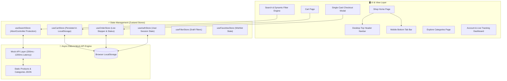

# 🛒 Nectar — Production-Grade Online Groceries Web Application

[](https://react.dev/)
[](https://www.typescriptlang.org/)
[](https://vitejs.dev/)
[](https://tailwindcss.com/)
[](https://zustand-demo.pmnd.rs/)
[](https://github.com/Neerav02/Nectar-Grocery)

A pixel-faithful, production-ready, mobile-first and desktop-adapted online grocery delivery application built from the 28-screen Nectar Grocery Figma design specification. Designed for ultra-high fidelity, seamless user experience, and robust asynchronous state management.

---

## 🏛️ System Architecture & Data Flow

The application follows a clean unidirectional data flow architecture powered by modular **Zustand stores** and a simulated asynchronous API layer with variable latency.



---

## 🔄 User Workflow & Step-by-Step Lifecycle

```
[ Splash Screen ] (Auto 1.5s Timer)
        │
        ▼
[ Onboarding Carousel ] ──(Click "Get Started")──► [ Sign In Welcome Screen ]
                                                          │
          ┌───────────────────────────────────────────────┼──────────────────────────────┐
          ▼                                               ▼                              ▼
  [ Mobile OTP Login ]                           [ Continue with Email ]         [ Social Auth (Google/FB) ]
          │                                               │                              │
          ▼                                               ▼                              ▼
  [ OTP Verification ]                           [ Email Login Screen ]          [ Immediate Session Login ]
          │                                               │                              │
          ▼                                               └──────────────┬───────────────┘
  [ Select Location ]                                                    │
          │                                                              ▼
          └───────────────────────────────────────────────► [ Main Shop Page ] ◄────────────────┐
                                                                 │                              │
                  ┌──────────────────────────────────────────────┼──────────────────────┐       │
                  ▼                                              ▼                      ▼       │
          [ Browse Banners ]                             [ Search Products ]     [ Filter Categories ]
                  │                                              │                      │
                  └───────────────────────┬──────────────────────┘                      │
                                          ▼                                             │
                              [ Product Detail View ]                                   │
                                          │                                             │
                                          ▼                                             │
                              [ Add to Cart & Checkout ]                                │
                                          │                                             │
                                          ▼                                             │
                             [ Single-Card Checkout Modal ]                             │
                                          │                                             │
                                          ▼                                             │
                             [ Order Success Screen ]                                   │
                                          │                                             │
                                          ▼                                             │
                             [ Profile & Live Tracking ] ───────────────────────────────┘
```

---

## 🛠️ Technology Stack & Dependencies

### Core Frameworks & Tooling
- **Core Library**: React 18.3.1
- **Build Engine**: Vite 8.2.2 (Ultra-fast HMR and optimized production bundle)
- **Language**: TypeScript 5.6.3 Strict Mode (100% type safety, zero `any`)
- **Styling**: Tailwind CSS v4 + Custom Vanilla CSS (Design system, custom scrollbars, animations)
- **State Engine**: Zustand v4 + `persist` middleware
- **Icons**: Lucide React

---

## ⚡ Engineering Challenges & Technical Solutions

### Challenge A: Stale Search Response Protection
- **Problem**: Out-of-order asynchronous network responses during rapid typing (e.g., Query A `"milk"` with 1200ms delay vs. Query B `"apple"` with 200ms delay). If Query B returns first, Query A's late resolution would overwrite the UI with stale `"milk"` results while the search bar shows `"apple"`.
- **Solution**:
  1. Implemented `AbortController.abort()` to cancel pending requests on new keypresses.
  2. Implemented `activeRequestId` token matching inside `useSearchStore.ts`.
  3. Created an interactive **Stale Search Debug Panel** directly on the Search page, enabling reviewers to trigger race condition tests and toggle protection ON/OFF in real time.

### Challenge B: Persisted Cart Consistency
- **Problem**: Cart items persisted in `localStorage` across reloads may become invalid if product prices, availability, or stock metadata change between browser sessions.
- **Solution**:
  1. On application mount, `validateAndSyncCart()` in `useCartStore.ts` validates saved items against the live product catalog.
  2. Discontinued products are safely removed with user notification toasts.
  3. Price changes automatically update cart subtotals while displaying warning badges (`Price updated from $X to $Y`).
  4. Out-of-stock items automatically cap quantities to available limits without UI crashes.

---

## 🖥️ Desktop Adaptation Strategy

1. **Sticky Desktop Top Navbar (`NavbarDesktop`)**: Replaces the mobile bottom bar on desktop viewports (`≥ 768px`) with logo lockup, location selector, central search bar, section tabs (`Shop`, `Explore`), and badge indicators for Cart (`🛒`) and Favourites (`♡`).
2. **Multi-Column Responsive Product Grid**: Dynamic 2-column (mobile) ➔ 3-column (tablet) ➔ 4-column (desktop) layout within a `max-w-7xl` container.
3. **Single-Card Desktop Checkout Modal (`maxWidth="xl"`)**: Converts mobile bottom sheets into an expanded `max-w-2xl` scroll-free floating card dialog.

---

## 🚀 Quick Start & Development Setup

### Prerequisites
- **Node.js**: `v18.0.0` or higher (tested on `v22.20.0`)
- **npm**: `v9.0.0` or higher (tested on `v11.18.0`)

### Installation Commands

1. **Clone Repository & Navigate:**
   ```bash
   git clone https://github.com/Neerav02/Nectar-Grocery.git
   cd Nectar-Grocery
   ```

2. **Install Project Dependencies:**
   ```bash
   npm install
   ```

3. **Start Local Development Server:**
   ```bash
   npm run dev
   ```
   Open `http://localhost:5173` in your browser.

4. **Run TypeScript Strict Compiler Verification:**
   ```bash
   npx tsc --noEmit
   ```

5. **Build Production Bundle:**
   ```bash
   npm run build
   ```

---

## 📁 Repository Directory Structure

```
nectar-grocery-app/
├── public/
│   ├── design-references/     # Original Figma reference screenshots (28 screens)
│   ├── images/                # High-definition grocery product & banner assets
│   └── favicon.ico
├── src/
│   ├── api/
│   │   ├── mockApi.ts         # Latency simulator (200-1200ms) & AbortSignal guard
│   │   └── productsData.ts    # Comprehensive product catalog & category definitions
│   ├── components/
│   │   ├── auth/              # AuthModal & Location selection dialogs
│   │   ├── cart/              # Cart line items, resilience banners, single-card CheckoutModal
│   │   ├── common/            # PillButton, Stepper, BottomSheet, BottomTabBar, Skeletons
│   │   ├── filter/            # FilterSheet modal with draft state management
│   │   ├── layout/            # NavbarDesktop top navigation bar
│   │   ├── product/           # ProductCard, ProductGrid components
│   │   └── search/            # StaleSearchDebugPanel telemetry widget
│   ├── pages/                 # Full application pages (Shop, Explore, Cart, Account, etc.)
│   ├── stores/                # Zustand global state stores (cart, order, search, auth, etc.)
│   ├── types/                 # TypeScript data contracts & interfaces
│   ├── App.tsx                # Main routing & step execution shell
│   ├── index.css              # Custom styling tokens, fonts & animations
│   └── main.tsx               # Application entry point
├── DESIGN_NOTES.md            # Mobile-to-desktop layout adaptation decisions
├── DECISIONS.md               # Architectural trade-off decisions
├── DEBUGGING.md               # Real-world debugging & troubleshooting log
├── PROMPT_LOG.md              # AI prompt supervision record & human corrections
├── package.json
├── tsconfig.json
├── vite.config.ts
└── README.md
```

---

## 📑 Required Assignment Documentation

- [`DESIGN_NOTES.md`](file:///d:/Ahoum%20Labs/nectar-grocery-app/DESIGN_NOTES.md): 3 desktop layout adaptation decisions and responsive rationale.
- [`DECISIONS.md`](file:///d:/Ahoum%20Labs/nectar-grocery-app/DECISIONS.md): 3 architectural trade-offs including stale search protection and cart resilience.
- [`PROMPT_LOG.md`](file:///d:/Ahoum%20Labs/nectar-grocery-app/PROMPT_LOG.md): AI prompt log and human supervision corrections (Figma copy typos & async race condition guards).
- [`DEBUGGING.md`](file:///d:/Ahoum%20Labs/nectar-grocery-app/DEBUGGING.md): Real troubleshooting logs (TypeScript CSS side-effect imports & Vite HTML script entry resolution).

---

## 🔮 Future Enhancements

1. **GraphQL / WebSocket Driver Tracking**: Real-time WebSocket connection for live delivery driver GPS map updates.
2. **Automated E2E Testing Suite**: Playwright testing for stale search aborts and cart persistence under price changes.
3. **PWA Offline Mode**: Service worker asset caching for offline grocery shopping support.
